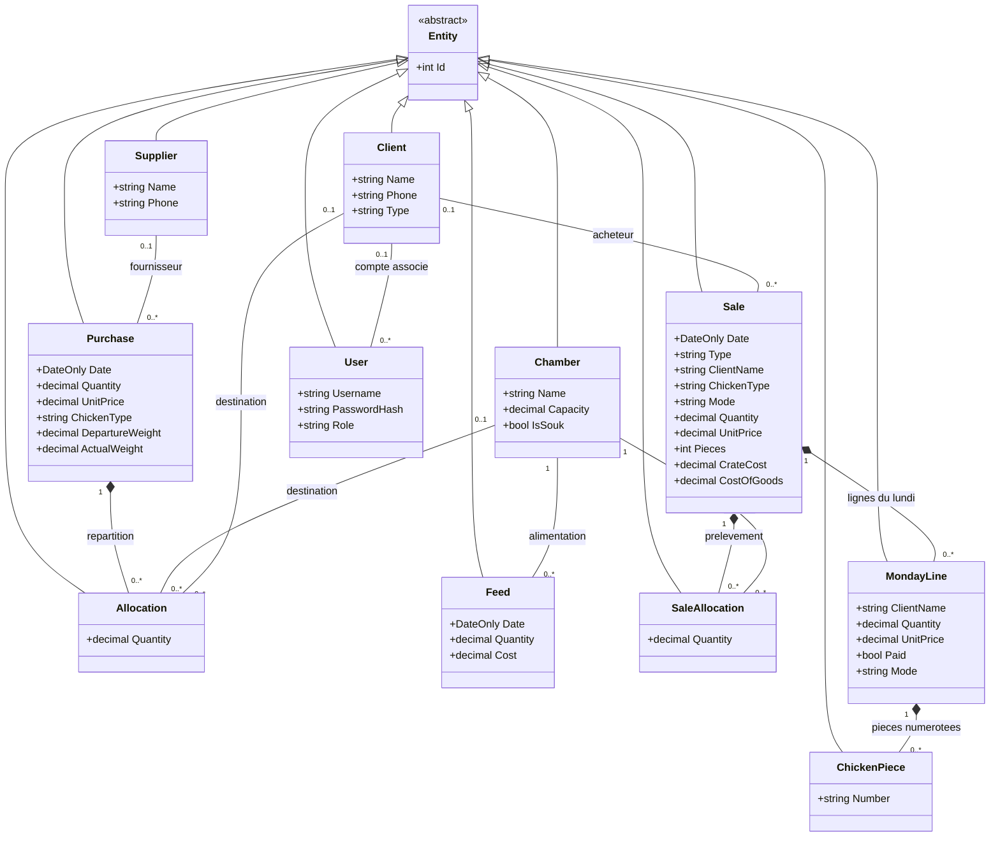

# Diagramme de classes — Gestion Poulet

Modèle métier d'après `src/Poulet.Domain/Entities.cs` et les relations configurées dans `src/Poulet.Infrastructure/AppDbContext.cs`.
Les propriétés métier principales sont représentées ; les clés étrangères sont exprimées par les associations et les collections par les compositions.
Les attributs `Notes` sont omis pour alléger la lecture.

- `Entity` est la classe abstraite commune : toutes les entités héritent de `Id`.
- `0..1` indique une référence facultative ; `1` une référence obligatoire ; `0..*` zéro ou plusieurs éléments.
- Le losange plein représente une composition : les allocations, lignes et pièces sont supprimées avec leur parent dans la configuration EF Core.
- `Phone`, `ClientName`, `DepartureWeight` et `ActualWeight` peuvent être nuls dans les classes où ils apparaissent ici.

Ce diagramme couvre le domaine métier ; les contrôleurs, commandes, handlers, interfaces de persistance et composants React ne sont pas représentés.
